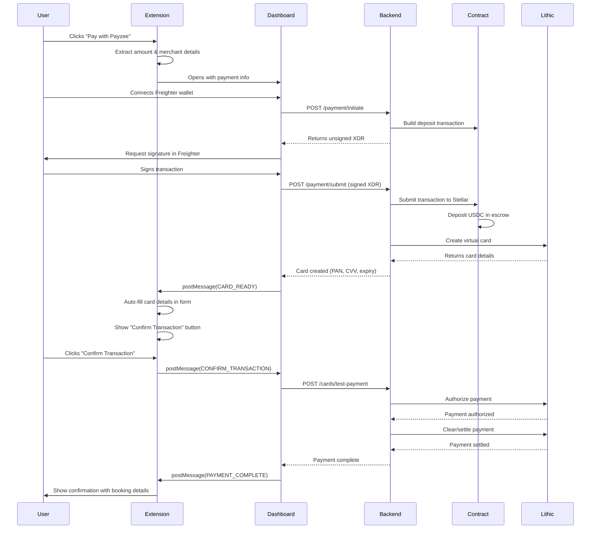
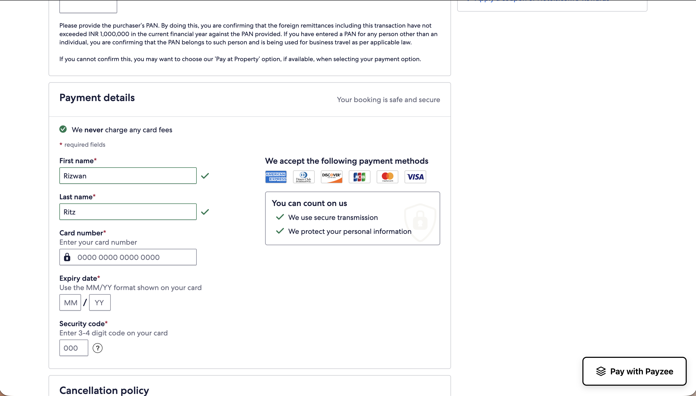
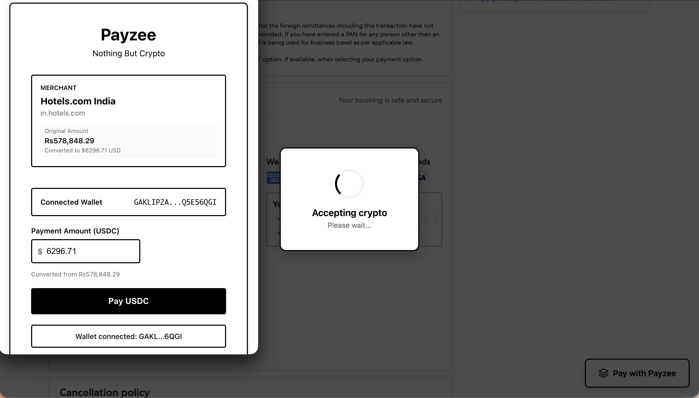
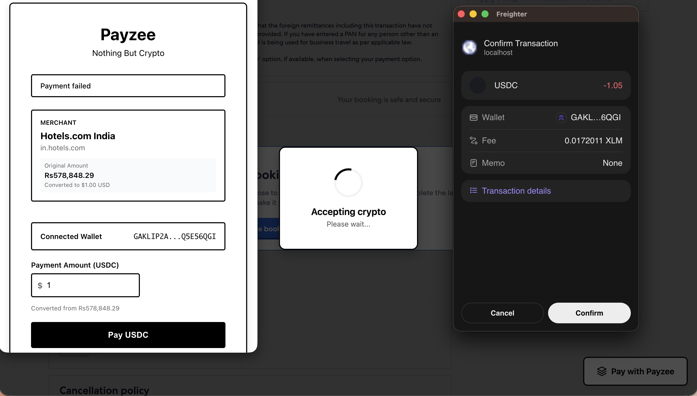
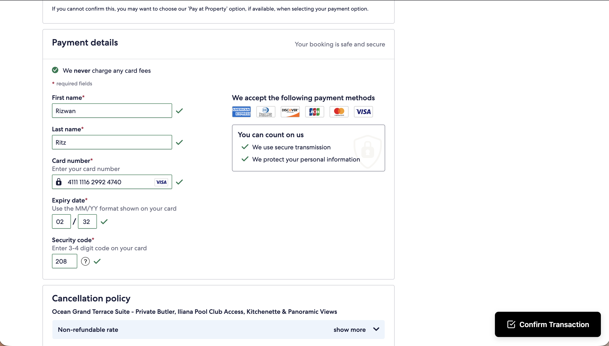
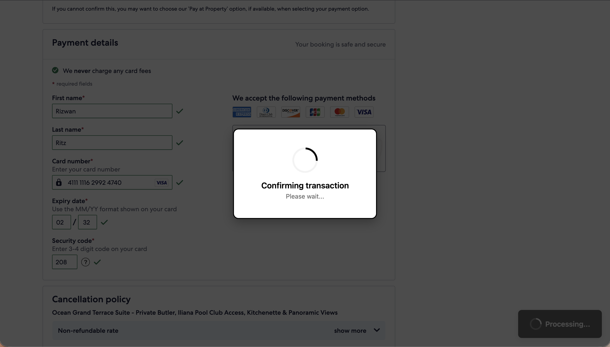
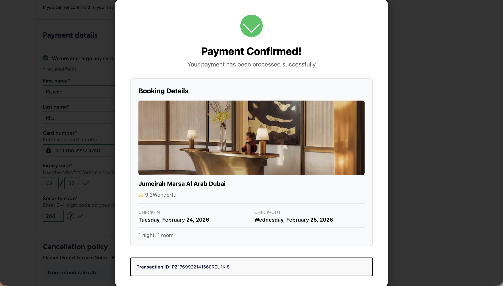

# Payzee

Pay for anything online using crypto (USDC on Stellar) - even on sites that don't accept it.


## Description

Payzee is a browser extension that bridges the gap between crypto and traditional e-commerce. It lets you pay with USDC on any checkout page by creating virtual debit cards on-demand. The merchant gets paid in fiat, you pay with crypto - it just works.

Built on Stellar blockchain using Soroban smart contracts for escrow, integrated with Lithic for instant virtual card issuance.

## Contract Address

**Stellar Testnet**: `CDSWWCK54G7N5U5DBYBBP3S4FFPGFOCJXDDOJLQ4HNSDPL2NC67CWQZ3`

## Problem Statement

### The Problem

Most online merchants don't accept cryptocurrency. Even though millions of people hold crypto, they can't use it for everyday purchases like booking hotels, flights, or buying products online. This creates a barrier to crypto adoption and limits the utility of digital assets.

### Our Solution

Payzee solves this by:
1. **Universal Acceptance** - Works on any checkout page, no merchant integration needed
2. **Instant Conversion** - Creates virtual debit cards that merchants accept as regular payment
3. **Trustless Escrow** - Uses Soroban smart contracts to hold funds securely until payment settles
4. **Seamless UX** - Auto-fills card details and handles everything in under 30 seconds

## Features

### Core Features
- **Auto-Detection** - Automatically detects checkout pages and shows payment option
- **Smart Extraction** - Extracts amount, currency, and converts to USD in real-time
- **Wallet Integration** - Connects with Freighter for Stellar transactions
- **Instant Card Creation** - Generates virtual Lithic cards on-demand
- **Auto-Fill** - Automatically fills card details into merchant forms
- **One-Click Payment** - Authorize and settle with single confirmation
- **Rich Confirmation** - Shows booking details with hotel images, dates, and location

### Technical Features
- Smart contract escrow for USDC
- Event-driven architecture
- Cross-origin messaging between extension and dashboard
- Native input event simulation for form compatibility
- Background image extraction from carousels
- Multi-currency support with real-time conversion

## How It Works

1. You're checking out somewhere (hotels, flights, whatever)
2. Click the "Pay with Payzee" button that appears
3. Connect your Stellar wallet (Freighter)
4. Your USDC gets deposited into a smart contract escrow
5. A virtual Lithic card gets created instantly
6. Card details auto-fill on the merchant page
7. Click confirm, payment goes through
8. You get a nice confirmation screen

The whole thing takes like 30 seconds.

## Sequence Diagram



## Architecture Overview

### System Architecture

```
┌─────────────────┐
│  Chrome Browser │
│                 │
│  ┌───────────┐  │      ┌──────────────┐
│  │ Extension │◄─┼──────┤   Dashboard  │
│  │ (Content) │  │      │   (React)    │
│  └─────┬─────┘  │      └──────┬───────┘
└────────┼────────┘             │
         │                      │
         │                      │
         └──────────┬───────────┘
                    │
              ┌─────▼──────┐
              │  Backend   │
              │  (FastAPI) │
              └─────┬──────┘
                    │
         ┌──────────┼──────────┐
         │                     │
    ┌────▼─────┐        ┌─────▼────┐
    │ Soroban  │        │  Lithic  │
    │ Contract │        │   API    │
    └──────────┘        └──────────┘
```

### Tech Stack

- **Extension**: Chrome extension (manifest v3) that detects checkout pages and injects the payment flow
- **Dashboard**: React app for the wallet connection and card management
- **Backend**: Python (FastAPI) that talks to Lithic for card creation and Stellar for blockchain stuff
- **Smart Contract**: Soroban (Rust) contract on Stellar testnet that holds the USDC in escrow
- **Blockchain**: Stellar testnet with USDC

## Screenshots

### Payment Flow

**1. Checkout Detection**


**2. Dashboard - Wallet Connect**


**3. Payment Processing**


**4. Auto-fill Card Details**


**5. Confirm Transaction**


**6. Payment Confirmation**


## Running it locally

### Backend
```bash
cd backend
python3 -m venv venv
source venv/bin/activate
pip install -r requirements.txt
python3 -m uvicorn src.main:app --reload --port 8000
```

You'll need a `.env` file with:
- `LITHIC_API_KEY` - get from Lithic sandbox
- `STELLAR_SECRET_KEY` - your Stellar account secret
- `CONTRACT_ADDRESS` - the deployed Soroban contract

### Dashboard
```bash
cd dashboard
npm install
npm run dev
```

Runs on http://localhost:3001

### Extension
1. Open Chrome → Extensions → Developer mode
2. Load unpacked → select the `extension` folder
3. Extension should appear in your toolbar

### Smart Contract
```bash
cd soroban-escrow
soroban contract build
soroban contract deploy --wasm target/wasm32-unknown-unknown/release/payzee.wasm --network testnet
```

Don't forget to initialize it with your admin address and USDC token address.

## Project structure

```
backend/          - FastAPI server
dashboard/        - React payment dashboard
extension/        - Chrome extension
soroban-escrow/   - Rust smart contract
```

## Deployed Link

**Live Dashboard**: [https://payzee-omega.vercel.app](https://payzee-omega.vercel.app)

**Backend API**: [https://payzee-production.up.railway.app](https://payzee-production.up.railway.app)

**Demo Video**: [Watch on YouTube](#)

## Notes

- Uses Stellar testnet (not real money)
- Lithic sandbox for virtual cards (test mode)
- Card details auto-fill works on most checkout pages (uses native input setters)
- Extracts booking details (hotel name, images, dates) for the confirmation screen

## Future Scope

### Short Term
- Support for multiple currencies (EURC, USDT, etc.)
- Mobile browser support
- Better error handling and retry logic
- Transaction history dashboard

### Medium Term
- Mainnet deployment with real Lithic cards
- Merchant analytics dashboard
- Cashback/rewards program in crypto
- Integration with other Stellar wallets (Albedo, Rabet)

### Long Term
- P2P payments using virtual cards
- Subscription management (Netflix, Spotify, etc.)
- DeFi integration for yield on escrowed funds
- White-label solution for merchants

## Built for

Stellar Build-A-Thon Delhi NCR 2026 Hackathon


